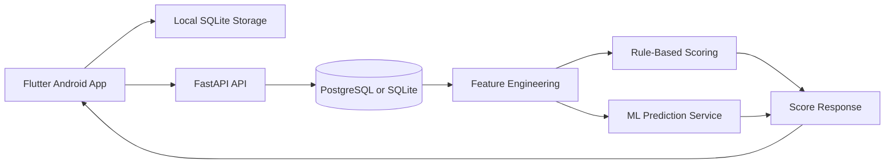

# LifeLens Presentation Content

> A presentation-ready content outline for the LifeLens Flutter application and its FastAPI/ML backend.

## Table of Contents

1. [Title](#1-title)
2. [Problem Statement](#2-problem-statement)
3. [Project Vision](#3-project-vision)
4. [Target Users](#4-target-users)
5. [Solution Overview](#5-solution-overview)
6. [Main Application Features](#6-main-application-features)
7. [User Journey](#7-user-journey)
8. [System Architecture](#8-system-architecture)
9. [Data Flow](#9-data-flow)
10. [Flutter Application](#10-flutter-application)
11. [Data Models](#11-data-models)
12. [Scoring and Machine Learning](#12-scoring-and-machine-learning)
13. [Model Details](#13-model-details)
14. [API Contract](#14-api-contract)
15. [Privacy, Security, and Reliability](#15-privacy-security-and-reliability)
16. [Limitations](#16-limitations)
17. [Future Improvements](#17-future-improvements)
18. [Conclusion](#18-conclusion)

---

## 1. Title

### LifeLens

#### A personal wellbeing and financial-awareness companion

LifeLens connects daily lifestyle habits, workload, and spending into one understandable view of personal wellbeing.

**Technology:** Flutter Android application, FastAPI backend, SQL database, and machine-learning risk models.

---

## 2. Problem Statement

Students and young professionals often manage sleep, screen time, workload, productivity, and spending in separate places. This makes it difficult to see how one area affects another until stress or financial pressure has already increased.

Common problems include:

- No single view of daily wellbeing and financial behaviour.
- Important trends are hidden when users look only at one day.
- Manual tracking can become difficult when data comes from different sources.
- Risk scores can be confusing when the reasoning behind them is not visible.
- Users need practical actions, not only charts or raw measurements.

---

## 3. Project Vision

LifeLens is designed to help users answer three questions:

1. **How am I doing today?**
2. **What patterns are developing over time?**
3. **What small action should I take next?**

The application combines personal tracking, trend analysis, explainable scoring, and risk classification in one mobile experience.

LifeLens provides estimates and recommendations. It is not a medical diagnosis service or a replacement for professional financial advice.

---

## 4. Target Users

LifeLens is primarily intended for:

- University students balancing study, deadlines, health, and personal expenses.
- Young professionals monitoring workload, screen time, sleep, and spending.
- Users who want a lightweight daily check-in instead of several separate tracking applications.

The interface is designed for quick daily entries, clear score cards, trends, and actionable recommendations.

---

## 5. Solution Overview

LifeLens has two cooperating parts:

### Flutter mobile application

- Collects manual and device-assisted lifestyle data.
- Stores data locally so the app remains useful offline.
- Displays scores, risk labels, charts, recommendations, and settings.
- Provides local notifications for important lifestyle risks.

### FastAPI backend

- Authenticates users and receives daily entries.
- Stores historical records for trend-based analysis.
- Builds rolling features over three-day and seven-day windows.
- Calculates explainable scores and runs trained risk models.
- Returns a compact score response to the Flutter client.

---

## 6. Main Application Features

### Dashboard

The dashboard is the primary summary view. It presents:

- Productivity score.
- Financial health score.
- Stress-risk score.
- Burnout-risk label.
- Overspending score and risk label.
- Recommendations generated from the user's current data.
- Trend charts and recent score snapshots.

### Expenses

Users can record:

- Amount.
- Category.
- Date.
- Note.
- Optional recurring label.

The expense history supports financial-health scoring and overspending analysis.

### Planner

Users can manage tasks with:

- Title and date.
- Low, medium, or high priority.
- Workload estimate.
- Completion state.
- Notes, reminders, and optional Google Calendar event linkage.

### Insights and wellbeing

Users can review or enter:

- Sleep duration.
- Steps.
- Screen-time duration.
- Mood, energy, and stress check-ins.
- Weekly sleep, screen-time, spending, and task-completion trends.

### Profile and settings

The profile area supports authentication, backend configuration, data controls, and integration settings.

### Device integrations

Where permissions are available, LifeLens can read:

- Steps and sleep through Android Health Connect.
- Screen-time and most-used applications through Android UsageStatsManager.

Manual input remains available when permissions or device data are unavailable.

---

## 7. User Journey

1. The user signs in or uses the local demo account.
2. The user records expenses, tasks, sleep, steps, and screen time.
3. LifeLens stores the source data locally in SQLite.
4. The app builds a daily prediction payload.
5. The backend stores the daily entry and combines it with recent history.
6. Rule-based scoring and ML prediction produce scores, risk labels, and recommendations.
7. The Flutter dashboard displays the result in a readable format.
8. The user reviews trends and takes a suggested next action.

---

## 8. System Architecture



### Technology stack

| Layer | Technology | Role |
|---|---|---|
| Mobile UI | Flutter and Dart | Cross-platform application interface |
| Charts | `fl_chart` | Trend visualization |
| Local persistence | SQLite / SQLCipher | Offline-first source data and snapshots |
| Device data | Health Connect and UsageStats | Steps, sleep, and screen-time inputs |
| Backend API | FastAPI | Authentication, prediction, and data endpoints |
| Backend persistence | SQLAlchemy with PostgreSQL or SQLite | Historical daily records |
| ML runtime | Python, scikit-learn, XGBoost, Joblib | Model loading and inference |
| Notifications | Flutter local notifications | Lifestyle risk alerts |

---

## 9. Data Flow

The daily prediction flow is:

1. Flutter collects a `DailyHealthEntry`, expense total, planner workload, calendar events, and optional financial goals.
2. `PredictionPayload.toJson()` maps the data to the backend request schema.
3. The request is sent to `POST /predict/daily-score` with an authenticated bearer token.
4. The backend validates bounds and date information using Pydantic.
5. The daily record is inserted or updated for the user and date.
6. Recent records are converted into rolling features such as seven-day sleep, screen-time, workload, and spending averages.
7. Rule-based scores are calculated for productivity and financial health.
8. ML artifacts classify burnout and overspending risk when the required model is available.
9. The backend returns `ScoreResponse`.
10. Flutter parses the response into `LifestyleScores`, saves a snapshot, and updates the dashboard.

---

## 10. Flutter Application

The Flutter code is organized by feature and service responsibility:

| Area | Main responsibility |
|---|---|
| `features/auth` | Login, signup, and authentication gate |
| `features/dashboard` | Summary scores, trends, and recommendations |
| `features/expenses` | Expense entry and category breakdown |
| `features/planner` | Tasks, workload, priorities, and reminders |
| `features/insights` | Health input, device sync, wellbeing, and explanations |
| `features/profile` | User profile, developer tools, and settings |
| `services/lifelens_store.dart` | State, local scoring, sync, and history |
| `services/local_database_service.dart` | SQLite persistence |
| `services/prediction_api_service.dart` | FastAPI communication |
| `services/device_data_service.dart` | Health Connect and UsageStats access |
| `services/notification_service.dart` | Local risk notifications |

The application keeps a local score fallback. This means a temporary network or backend failure does not prevent the user from viewing the core experience.

---

## 11. Data Models

### Daily lifestyle input

`DailyHealthEntry` represents the main wellbeing measurements:

- `sleepHours`
- `steps`
- `screenTimeHours`
- `source`
- `date`

### Expense input

`ExpenseEntry` represents a financial event with amount, category, date, note, and optional recurrence information.

### Planner input

`PlannerEntry` represents a task with title, date, priority, workload, completion state, notes, reminders, and optional calendar linkage.

### Prediction request

`PredictionPayload` combines wellbeing, spending, calendar, workload, income, and budget data into one daily request.

### Prediction response

`LifestyleScores` stores:

- Productivity from 0 to 100.
- Financial health from 0 to 100.
- Stress risk from 0 to 100.
- Burnout risk: `Low`, `Medium`, or `High`.
- Overspending score from 0 to 100.
- Overspending risk: `Low`, `Medium`, or `High`.
- A list of recommendations.

### Historical snapshot

`ScoreSnapshot` keeps date-based values for charts and trend comparisons, including spending, sleep, screen time, and workload.

---

## 12. Scoring and Machine Learning

LifeLens intentionally uses a hybrid approach.

### Explainable rule-based scoring

Deterministic formulas calculate:

- **Productivity:** sleep, activity, focus, and workload penalty.
- **Financial health:** spending compared with a monthly budget or fallback baseline.
- **Recommendations:** thresholds such as low sleep, high screen time, high workload, or elevated spending.

These scores are easy to explain to users and continue to work when model artifacts are unavailable.

### ML risk classification

Machine learning is used where recent history and multiple interacting factors are useful:

- Static stress classification.
- Burnout trend classification.
- Overspending risk classification.

The models return risk categories rather than pretending to provide a clinical diagnosis or an exact future outcome.

### Stress and burnout ensemble

The final stress/burnout result combines:

- 40% static stress model contribution.
- 60% burnout trend model contribution.

This gives recent behavioural trends more influence while still using same-day lifestyle indicators.

---

## 13. Model Details

### Static stress model

- **Data:** Sleep Health and Lifestyle dataset, 374 rows.
- **Target:** `stress_risk` with `Low`, `Medium`, and `High` categories.
- **Features:** sleep duration and quality proxies, steps, activity, workload, and sleep decline.
- **Compared estimators:** Logistic Regression, Random Forest, and Histogram Gradient Boosting.
- **Reported evaluation:** 92.00% accuracy and 91.43% balanced accuracy on 75 test samples.

The input mappings are proxies because the application does not collect every original dataset field directly.

### Burnout trend model

- **Data:** synthetic longitudinal data representing 150 users across 21 days.
- **Features:** three-day and seven-day sleep averages, sleep trend, screen-time averages and trend, workload average, and high-priority tasks.
- **Target:** synthetic `burnout_risk` category.
- **Estimator:** XGBoost through the shared labelled wrapper.
- **Reported evaluation:** 98.89% accuracy and 99.23% balanced accuracy on 450 test samples.

These results mainly show that the model learned the synthetic generator's rules. They are not clinical validation results.

### Overspending model

- **Data:** real income and expense dataset with 20,000 rows.
- **Features:** income, estimated monthly spending, and expense-to-income ratio.
- **Estimator:** Histogram Gradient Boosting Classifier.
- **Output:** overspending score from 0 to 100 plus a risk category.
- **Runtime history:** daily spending is converted into an estimated monthly value using a seven-day average.

The target is derived from the expense ratio, so the reported 100% accuracy demonstrates consistency with the rule rather than real-world predictive power.

### Training artifacts

The trained Joblib artifacts are stored in `backend/app/ml/artifacts/` and loaded by the prediction service at runtime. Training scripts are available for the static stress, burnout, and overspending models.

---

## 14. API Contract

### Endpoint

```text
POST /predict/daily-score
```

### Request example

```json
{
  "sleep_hours": 7.2,
  "steps": 6800,
  "screen_time_hours": 5.4,
  "daily_spending": 18.5,
  "calendar_events": 4,
  "high_priority_tasks": 2,
  "total_workload": 6,
  "monthly_income": 1800,
  "monthly_budget": 900,
  "entry_date": "2026-10-10"
}
```

### Response example

```json
{
  "productivity": 72,
  "financial_health": 81,
  "stress_risk": 38,
  "burnout_risk": "Low",
  "overspending_score": 35,
  "overspending_risk": "Low",
  "recommendations": [
    "Reduce screen time before sleep"
  ]
}
```

The exact recommendation text depends on the user's data and active scoring rules.

---

## 15. Privacy, Security, and Reliability

### Privacy principles

- Collect only the lifestyle and financial fields needed for the product experience.
- Keep local application data in SQLite/SQLCipher storage.
- Use secure storage for sensitive session data.
- Provide account data deletion support.
- Treat predictions as private personal information.

### Security controls

- Bearer-token authentication for protected prediction requests.
- Refresh-token flow for session renewal.
- Password validation through the backend schema.
- HTTPS deployment support for the production backend.
- Environment-based configuration for database and model paths.

### Reliability features

- Local SQLite persistence.
- Backend sync with local fallback.
- Manual input when device permissions are unavailable.
- Formula fallback when ML artifacts cannot be loaded.
- Local notifications for high-risk conditions.

---

## 16. Limitations

- Burnout training data is synthetic and does not represent every real user.
- Burnout and stress outputs are risk estimates, not medical diagnoses.
- Overspending labels are derived from a formula rather than human-labelled outcomes.
- Static stress features include proxy mappings from the public dataset.
- Seven-day financial estimates can be unstable when the app has little history.
- Device integrations depend on Android permissions and data availability.
- Model evaluation results should not be presented as proof of clinical or financial advice quality.

These limitations should be stated clearly during the presentation to keep the project claims accurate and responsible.

---

## 17. Future Improvements

### Product improvements

- Add richer personalized goals and habit plans.
- Improve weekly and monthly report generation.
- Add more calendar providers and wearable integrations.
- Support exportable personal reports.
- Improve notification timing and user controls.

### ML improvements

- Collect consented, anonymized longitudinal data for real-world validation.
- Calibrate risk probabilities instead of returning only categories.
- Add model monitoring and drift detection.
- Evaluate fairness across different user groups.
- Compare personalized baselines with population-level models.
- Replace proxy targets with validated labels where appropriate.

### Privacy improvements

- Expand on-device inference where practical.
- Add clearer consent and retention controls.
- Provide a complete data access and export workflow.
- Minimize backend retention of raw lifestyle records.

---

## 18. Conclusion

LifeLens turns fragmented daily information into one understandable feedback loop:

**collect data -> understand trends -> estimate risk -> recommend an action -> track change**

Its main strength is the combination of:

- A practical Flutter mobile experience.
- Offline-first local storage.
- Explainable score formulas.
- Trend-aware machine-learning models.
- Clear limitations and responsible interpretation.

LifeLens is a foundation for a personal wellbeing assistant that helps users notice patterns early and make more informed daily decisions.
